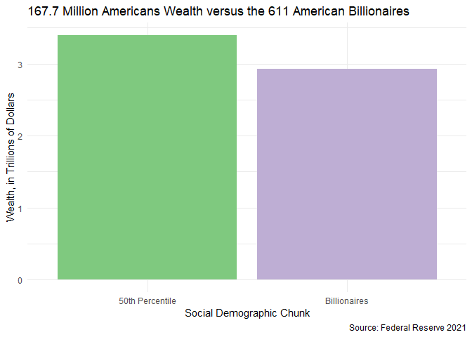
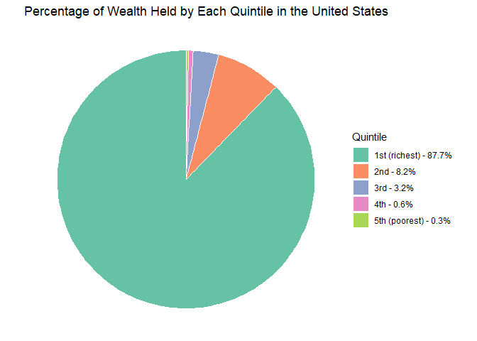

## Shiny App

Please find our deployed shiny app [here](https://jinfei.shinyapps.io/bil-wealth-app/). It contains a 

```{r load-packages, message = FALSE, warning = FALSE, echo = FALSE}
library(tidyverse)
library(knitr)
library(scales)
```

```{r load-data, echo = FALSE}
bil <- read.csv("data/billionaire/Forbes Annual Report Data - 2020.csv", skip = 1) %>% drop_na()
mob <- read.csv("data/wealth-mobility/2-wealth-structure.csv")
```

## Introduction

An important component of Data Visualization is perspective. When there is an extreme outlier in a data visualization, we do all kinds of data visualization magic tricks to help keep everything in perspective. For example, we log our axes so that everything can fit on a single pane. We also might facet our outliers so that they appear on adjacent panes and are more visible because they are being compared to other outliers. For example, consider the below graph:

```{r echo = FALSE}

example_log <- data.frame(name = c("Jeff Bezos Wealth", "UChicago Endowment", "Med. USA Household Wealth"),
                          wealth = c(132800000000,8600000000, 121700))

example_log %>%
  ggplot(aes(y = name, x = wealth)) +
  geom_col(fill = "#93E9BE") +
  scale_x_log10() +
  labs(y = "",
       x = "Wealth (Logged Axis)",
       title = "Logged Axis Example of Wealth (Dollars)") +
  theme_minimal()
  
```

Here, we have a few differing levels of wealth. One shows the U.S. Median Household wealth, which is about $121,700. The other two are the University of Chicago Endowment and Jeff Bezos' wealth, which is about 8.6 billion and 132.8 billion dollars, respectively. Thanks to the logging of the axes, we are able to accurately assess what the exact values of each of the categories are. These methods of creating perspective are valuable and important, and we aim to lean into these methods in this project, however, we also aim to lean into the usefulness of not using these perspective tricks. 

A shortcoming of the above graph is that it does a poor job of highlighting the differences between the three observations. Jeff Bezos' wealth is a little over 15 times the size of UChicago's, but the bars are misleadingly similar in size, as is the nature of logged axes. Perhaps even more shocking in the context of this visualization is that Bezos' wealth is well over 1 million times as large the average American household's wealth, but Jeff Bezos' bar is only about 2.5 times as large. On the other hand, if we were not to incorporate a logged axis and if one were to instead create another bar graph showing a billionaire’s wealth, such as Elon Musk’s wealth, next to the combined wealth of 100 randomly sampled Americans, you would not be able to see the bar of even the combined wealth of all those Americans if it were next to Elon Musk's wealth in the visualization.  It would not matter if that bar was 1 randomly sampled person in America or 1000, it would still be one or two pixels in height, the difference being indiscernible, which is the point of some of the visualizations we aim to create, which is: to express the sheer unimaginable and insurmountable magnitude of extreme wealth.

Global wealth and income inequality is at an all time high, however, the magnitude of this inequality is difficult to fathom. Often, the uber wealthy of society are worshiped for their resilience and innovation, when in reality it might do some good to scorn them for their greed and malice. A resource that helps people more easily digest the extreme wealth disparity may shift people away from the deification of the world’s oligarchs, and shift people toward the rally against such rapacious behavior. We aim to answer the following questions in an attempt to clarify the realities of wealth/income inequality, and deploy our answers to a Shiny application for wider accessibility:
Our high level goal is to create an easily digestible application which conveys the true scale of global wealth and income inequality.  

## Repository Orgnization

- `data`: This folder contains data needed for our analysis and visualization
- `proposal`: This folder contains the rmarkdown and markdown of our proposal
- `analysis`: This folder contains all the analysis and visualization files of our project. It also contains the code for our application/presentation. The application also serves as the presentation. 
  - `wealth-quintiles`: This folder contains analysis about different wealth quintiles.
  - `geo-spatial-analysis`: This folder contains geo-spatial analysis and industry analysis of billionaires.
- `bil-wealth-app`: This folder contains codes and files for our shiny app.

### Wealth Inequality  

- How many of America's poorest would it take to match the wealth of America's richest (billionaires)?  

**While getting an exact count wasn't possible, this highlights a rough approximation that compares the two stark categories of American wealth: the richest and the poorest. In total, 167.7 million Americans wealth from the median and below have only about 17% more combined wealth than the combined wealth of the 611 richest.** 



- Who, or what, are these billionaires? What industry are they in and where?

**As we can see from the plots below, there are a large number of billionaires living in some of the most populous states. It seems that population and number of billionaires may have a somewhat rough but present linear association with population of the state. Additionally, we see that about half all billionaires are in three industries: Finance, technology, and food & beverage. Unsurprisingly, the "money" industry, i.e. Finance & Investments, is the biggest billionaire maker of all of the categories.**

  


- What can the wealth of a billionaire accomplish?  Does anybody really need so much wealth? 


To answer this question, we decided to build a reactive shiny application which allows users to input a quantity of highly expensive items to try and match the wealth of any of the billionaires on Forbe's list. We include options such as the cost for a week long trip to Hawaii ($4,000), the cost of a modest house in Hollywood ($3 million), and the cost of building (and naming) the UChicago Booth School of Business ($300 million). The goal is to try to spend enough money to match the wealth of the selected billionaire. One will quickly find that it is extremely tedious just to spend the billionaire's money if the click on the arrows to increment their various purchases. A central plot shows the user how they have spent their money thus far and how much money they have remaining.


- If we look at the wealth of the population as opposed to just focusing on extremes, i.e. the wealth of billionaires versus America's poorest, does wealth inequality still look that extreme?

**By dividing United States wealth into 5 quantiles (0%-20%, 20%-40%, 40%-60, 60%-80%, 80%-100%), we visualize the distribution of wealth more broadly across the entire population. Still, we find an extreme gap. The richest quintile has about 300 times the wealth of the poorest, and furthermore, the richest quintile has about 7 times more wealth than the other 80% of the population combined. Also of note, the poorest quintile and the 2nd poorest quintile have less than 1% of the total wealth.**



## Data

To answer these questions, we relied on the following datasets and statistics:  

* Billionaire List
[The Forbes Billionaire's List](https://docs.google.com/spreadsheets/d/1JThOdF95e0NYoea5pCWd5UDXLmIGc1Fwj1aajDSYYhk/edit#gid=685599441). The dataset provides information about billionaire's networths, how old they are, what industry they are in, their gender, and their location. 

* Wealth Mobility Dataset
[The Wealth Mobility Dataset](https://github.com/fpfeffer/WealthMobility/blob/master/Data/2-wealth-structure.csv). The dataset breaks down how wealth is divided up by their original and destined quintiles and race. It also provides intra-quartile and quintile breakdowns, such as information about the wealthiest quintile within the poorest quintile. 

* Federal Reserve Dataset (Simplified by Bloomberg):  
[The Federal Reserve Dataset](https://www.bloomberg.com/news/articles/2021-12-17/wealth-share-rose-in-pandemic-for-poorest-50-and-top-1-of-u-s) was simplified by Bloomberg. We used this to determine contemporary wealth levels of Americans, specifically the wealth median of America.  

* Mian & Sufi 2014 (Excerpt, Chicago Booth):
[The Mian & Sufi Paper](https://www.chicagobooth.edu/review/how-high-debt-leads-to-income-inequality) breaks down several wealth quintile statistics. Specifically, the amount of wealth in each quintile as well as the break downs of the distribution of wealth within each quintile.

