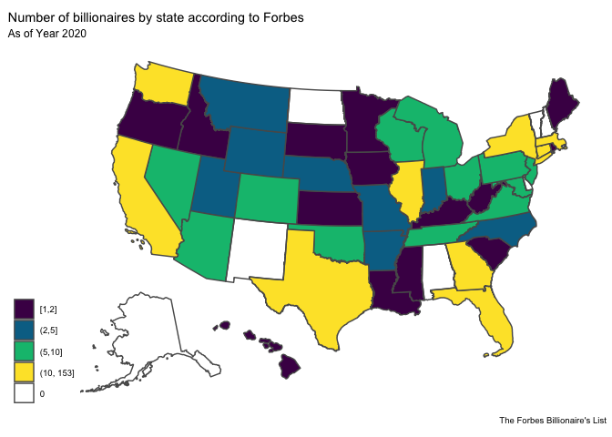
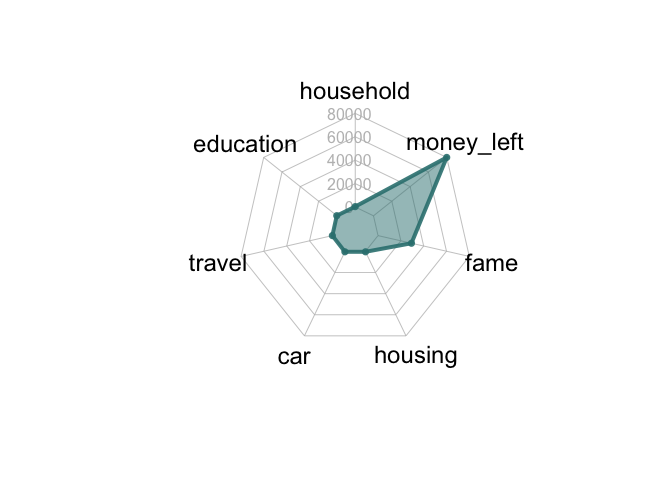

GeoSpatial Analysis of Wealth Inequality Visualized
================
Superb Bilby

``` r
library(tidyverse)
```

    ## ── Attaching packages ─────────────────────────────────────── tidyverse 1.3.1 ──

    ## ✔ ggplot2 3.3.6     ✔ purrr   0.3.4
    ## ✔ tibble  3.1.7     ✔ dplyr   1.0.8
    ## ✔ tidyr   1.2.0     ✔ stringr 1.4.0
    ## ✔ readr   2.1.2     ✔ forcats 0.5.1

    ## ── Conflicts ────────────────────────────────────────── tidyverse_conflicts() ──
    ## ✖ dplyr::filter() masks stats::filter()
    ## ✖ dplyr::lag()    masks stats::lag()

``` r
library(sf)
```

    ## Linking to GEOS 3.9.1, GDAL 3.4.0, PROJ 8.1.1; sf_use_s2() is TRUE

``` r
library(rnaturalearth)
library(colorspace)
library(tigris)
```

    ## To enable caching of data, set `options(tigris_use_cache = TRUE)`
    ## in your R script or .Rprofile.

``` r
library(fmsb)

# set default theme for ggplot2
ggplot2::theme_set(ggplot2::theme_minimal(base_size = 16))
```

## Geospatial Distribution

``` r
# Don't drop_na() for bil data -> na value for state denotes international billionaire
bil <- read.csv("../data/billionaire/Forbes Annual Report Data - 2020.csv", skip = 1) %>% drop_na()
mob <- read.csv("../data/wealth-mobility/2-wealth-structure.csv")
# parse wealth into number
bil <- bil %>%
  mutate(Wealth..Millions. = parse_number(Wealth..Millions.))
head(bil)
```

    ##     Name.and.Rank Wealth..Millions.    Surname World.Rank Age
    ## 1      Jeff Bezos            113000      Bezos          1  56
    ## 2      Bill Gates             98000      Gates          2  64
    ## 3  Warren Buffett             67500    Buffett          4  89
    ## 4   Larry Ellison             59000    Ellison          5  75
    ## 5 Mark Zuckerberg             54700 Zuckerberg          7  35
    ## 6      Jim Walton             54600     Walton          8  71
    ##        Wealth.Source              Industry Gender      State
    ## 1             Amazon            Technology      M Washington
    ## 2          Microsoft            Technology      M Washington
    ## 3 Berkshire Hathaway Finance & Investments      M   Nebraska
    ## 4           software            Technology      M California
    ## 5           Facebook            Technology      M California
    ## 6            Walmart      Fashion & Retail      M   Arkansas

Note: The Choropleth draws very slowly. I decide to draw a png first and
put the plot into the shiny app instead of generate it in real time.

``` r
# read spatial geometry from tigris package
states_sf <- states() %>%
  shift_geometry()
```

    ## Retrieving data for the year 2020

    ##   |                                                                              |                                                                      |   0%  |                                                                              |                                                                      |   1%  |                                                                              |=                                                                     |   1%  |                                                                              |=                                                                     |   2%  |                                                                              |==                                                                    |   2%  |                                                                              |==                                                                    |   3%  |                                                                              |===                                                                   |   4%  |                                                                              |=====                                                                 |   7%  |                                                                              |=====                                                                 |   8%  |                                                                              |======                                                                |   8%  |                                                                              |======                                                                |   9%  |                                                                              |=======                                                               |   9%  |                                                                              |=======                                                               |  10%  |                                                                              |=======                                                               |  11%  |                                                                              |========                                                              |  11%  |                                                                              |========                                                              |  12%  |                                                                              |=========                                                             |  12%  |                                                                              |=========                                                             |  13%  |                                                                              |=========                                                             |  14%  |                                                                              |==========                                                            |  14%  |                                                                              |==========                                                            |  15%  |                                                                              |================                                                      |  23%  |                                                                              |=================                                                     |  24%  |                                                                              |=================                                                     |  25%  |                                                                              |==================                                                    |  25%  |                                                                              |==================                                                    |  26%  |                                                                              |=====================                                                 |  30%  |                                                                              |======================                                                |  31%  |                                                                              |======================                                                |  32%  |                                                                              |=======================                                               |  32%  |                                                                              |========================                                              |  34%  |                                                                              |============================                                          |  40%  |                                                                              |================================                                      |  46%  |                                                                              |===================================                                   |  50%  |                                                                              |====================================                                  |  51%  |                                                                              |=====================================                                 |  53%  |                                                                              |======================================                                |  54%  |                                                                              |=============================================                         |  64%  |                                                                              |=============================================                         |  65%  |                                                                              |==============================================                        |  65%  |                                                                              |==============================================                        |  66%  |                                                                              |===============================================                       |  67%  |                                                                              |===============================================                       |  68%  |                                                                              |================================================                      |  68%  |                                                                              |================================================                      |  69%  |                                                                              |=================================================                     |  70%  |                                                                              |========================================================              |  80%  |                                                                              |=========================================================             |  81%  |                                                                              |=========================================================             |  82%  |                                                                              |==========================================================            |  83%  |                                                                              |===========================================================           |  84%  |                                                                              |===========================================================           |  85%  |                                                                              |==================================================================    |  94%  |                                                                              |==================================================================    |  95%  |                                                                              |===================================================================   |  95%  |                                                                              |===================================================================== |  98%  |                                                                              |===================================================================== |  99%  |                                                                              |======================================================================|  99%  |                                                                              |======================================================================| 100%

``` r
# group by and count billionaire
bil_by_state <- bil %>%
  select(State)%>%
  filter(State %in% state.name)%>%
  group_by(State) %>%
  summarise(n = n())
head(bil_by_state)
```

    ## # A tibble: 6 × 2
    ##   State           n
    ##   <chr>       <int>
    ## 1 Arizona        10
    ## 2 Arkansas        5
    ## 3 California    153
    ## 4 Colorado        8
    ## 5 Connecticut    14
    ## 6 Florida        57

``` r
# combine data to 
bil_combined <- states_sf %>%
  filter(NAME %in% state.name) %>%
  left_join(bil_by_state, by = c("NAME" = "State")) %>%
  mutate(rate_cut = cut_number(n, n = 4)) 
head(bil_combined)
```

    ## Simple feature collection with 6 features and 16 fields
    ## Geometry type: MULTIPOLYGON
    ## Dimension:     XY
    ## Bounding box:  xmin: -91843.51 ymin: -1354601 xmax: 2042471 ymax: 1323908
    ## Projected CRS: USA_Contiguous_Albers_Equal_Area_Conic
    ##   REGION DIVISION STATEFP  STATENS GEOID STUSPS          NAME LSAD MTFCC
    ## 1      3        5      54 01779805    54     WV West Virginia   00 G4000
    ## 2      3        5      12 00294478    12     FL       Florida   00 G4000
    ## 3      2        3      17 01779784    17     IL      Illinois   00 G4000
    ## 4      2        4      27 00662849    27     MN     Minnesota   00 G4000
    ## 5      3        5      24 01714934    24     MD      Maryland   00 G4000
    ## 6      1        1      44 01219835    44     RI  Rhode Island   00 G4000
    ##   FUNCSTAT        ALAND      AWATER    INTPTLAT     INTPTLON  n
    ## 1        A  62266296765   489206049 +38.6472854 -080.6183274  1
    ## 2        A 138958484319 45975808217 +28.3989775 -082.5143005 57
    ## 3        A 143778461053  6216594318 +40.1028754 -089.1526108 17
    ## 4        A 206232157570 18949864226 +46.3159573 -094.1996043  2
    ## 5        A  25151895765  6979171386 +38.9466584 -076.6744939  9
    ## 6        A   2677759219  1323691129 +41.5964850 -071.5264901  1
    ##                         geometry rate_cut
    ## 1 MULTIPOLYGON (((1216736 270...    [1,2]
    ## 2 MULTIPOLYGON (((921195.6 -7... (10,153]
    ## 3 MULTIPOLYGON (((403640.3 36... (10,153]
    ## 4 MULTIPOLYGON (((-60269.56 1...    [1,2]
    ## 5 MULTIPOLYGON (((1576009 347...   (5,10]
    ## 6 MULTIPOLYGON (((1977964 726...    [1,2]

``` r
# Find the states without Billionnaire
states_no_bil <- bil_combined$NAME[is.na(bil_combined$rate_cut)]
states_no_bil
```

    ## [1] "New Hampshire" "Vermont"       "Delaware"      "New Mexico"   
    ## [5] "Alabama"       "North Dakota"  "Alaska"

“New Hampshire”, “Vermont”, “Delaware”, “New Mexico”, “Alabama”, “North
Dakota”, “Alaska” are the seven states without billionaires…

``` r
bil_choropleth <- ggplot(data = bil_combined) +
  geom_sf(mapping = aes(fill = rate_cut)) +
  scale_fill_discrete_sequential(palette = "viridis",
                                 rev = FALSE,
                                 labels = c("[1,2]", "(2,5]", "(5,10]", "(10, 153]", 0)) +
  # scale_fill_discrete_sequential(palette = "viridis",
  #                               rev = FALSE) +
  labs(
    title = "Number of billionaires by state according to Forbes",
    subtitle = "As of Year 2020", 
    caption = "The Forbes Billionaire's List",
    fill = NULL) +
    ggthemes::theme_map()
bil_choropleth
```

<!-- -->

``` r
ggsave("choropleth.png")
```

    ## Saving 7 x 5 in image

## TODO SCCATTER PLOT BY POPULATION OF EACH STATE, MEDIAN INCOME IN EACH STATE

## Industry Distribution

``` r
# TODO: Build a shiny app that choose industry and show top 10 billionaire table in that industry
industry_choices <- bil %>%
  distinct(Industry) %>%
  arrange(Industry) %>%
  pull(Industry)
industry_choices
```

    ##  [1] "Automotive"                 "Construction & Engineering"
    ##  [3] "Diversified"                "Energy"                    
    ##  [5] "Fashion & Retail"           "Finance & Investments"     
    ##  [7] "Food & Beverage"            "Gambling & Casinos"        
    ##  [9] "Healthcare"                 "Logistics"                 
    ## [11] "Manufacturing"              "Media & Entertainment"     
    ## [13] "Real Estate"                "Service"                   
    ## [15] "Sports"                     "Technology"                
    ## [17] "Telecom"

``` r
bil_by_industry <- bil %>%
  group_by(Industry)%>%
  summarise(n = n(),
            avg_wealth = mean(Wealth..Millions.))
bil_by_industry
```

    ## # A tibble: 17 × 3
    ##    Industry                       n avg_wealth
    ##    <chr>                      <int>      <dbl>
    ##  1 Automotive                    14      3886.
    ##  2 Construction & Engineering     3      3567.
    ##  3 Diversified                   10     10350 
    ##  4 Energy                        31      2713.
    ##  5 Fashion & Retail              44      8025 
    ##  6 Finance & Investments        160      3857.
    ##  7 Food & Beverage               57      3621.
    ##  8 Gambling & Casinos             5      7400 
    ##  9 Healthcare                    24      2850 
    ## 10 Logistics                      7      2300 
    ## 11 Manufacturing                 25      2484 
    ## 12 Media & Entertainment         36      5297.
    ## 13 Real Estate                   42      3369.
    ## 14 Service                       24      2750 
    ## 15 Sports                        23      3222.
    ## 16 Technology                   103      8087.
    ## 17 Telecom                        3      2600

``` r
num_by_industry_plot <- bil_by_industry %>%
  arrange(desc(n))%>%
  ggplot(mapping = aes(x = n, y = fct_reorder(Industry, n))) +
  # geom_col(aes(fill = Industry), show.legend = FALSE) +
  scale_fill_brewer(palette="BrBG")+
  geom_col() +
  labs(title = "Number of Billionaires by Industry",
       x = "Number of Billionaires",
       y = "Industry")
num_by_industry_plot
```

<!-- -->
\## Top n billionarie per industry

``` r
input_industry <- "Technology"
# input_industry <- "Telecom"

bil %>%
  filter(Industry == input_industry) %>%
  arrange(World.Rank) %>%
  top_n(n = 5)
```

    ## Selecting by State

    ##     Name.and.Rank Wealth..Millions.  Surname World.Rank Age Wealth.Source
    ## 1      Jeff Bezos            113000    Bezos          1  56        Amazon
    ## 2      Bill Gates             98000    Gates          2  64     Microsoft
    ## 3   Steve Ballmer             52700  Ballmer         11  64     Microsoft
    ## 4 MacKenzie Bezos             36000    Bezos         22  50    Amazon.com
    ## 5 Charles Simonyi              3500  Simonyi        538  71     Microsoft
    ## 6   Judy Faulkner              2500 Faulkner        836  76     health IT
    ##     Industry Gender      State
    ## 1 Technology      M Washington
    ## 2 Technology      M Washington
    ## 3 Technology      M Washington
    ## 4 Technology      F Washington
    ## 5 Technology      M Washington
    ## 6 Technology      F  Wisconsin

### How Rich They Are

``` r
# Choose a billionaire
name <- "Jeff Bezos"
wealth <- bil %>%
  filter(Name.and.Rank == name)%>%
  select(Wealth..Millions.) %>%
  as.numeric()
wealth
```

    ## [1] 113000

``` r
# individual price (in million)
us_household_income <- 0.065
uchicago_master <- 0.16
trip_hawaii <- 0.004
aston_martin <- 0.3
house_in_beverly_hill <- 3
name_school <- 300 # Name Chicago booth


# user input
num_us_household <- 5000
num_uchicago_master <- 1000
num_trip_to_hawaii <- 1000
num_aston_martin <- 1000
num_house_in_beverly_hill <- 100
num_name_school <- 100

# total price
total_household <- us_household_income * num_us_household
total_master <- uchicago_master * num_uchicago_master
total_trip <- trip_hawaii * num_trip_to_hawaii
total_car <- aston_martin * num_aston_martin
total_house <- house_in_beverly_hill * num_house_in_beverly_hill
total_fame <- name_school * num_name_school

money_left <- wealth - sum(total_household,
                            total_master,
                            total_trip,
                            total_car,
                            total_house,
                            total_fame)
spending <- c("Household Spending",
              "UChicago Master",
              "International Trip",
              "Aston Martin",
              "House in Beverly Hill",
              "Name UChicago Booth",
              "Money Left")

value <- c(total_household,
                total_master,
                total_trip,
                total_car,
                total_house,
                total_fame,
                money_left)

df <- data.frame("household" = total_household,
                 "education" = total_master,
                 "travel" = total_trip,
                 "car" = total_car,
                 "housing" = total_house,
                 "fame" = total_fame,
                 "money_left" = money_left)
head(df)
```

    ##   household education travel car housing  fame money_left
    ## 1       325       160      4 300     300 30000      81911

``` r
df_longer <- df %>%
            pivot_longer(cols = c("household",
                      "education",
                      "travel",
                      "car",
                      "housing",
                      "fame",
                      "money_left"),
                       names_to = "spending", 
                       values_to = "value")


# df_longer %>%
#   ggplot(aes(y=spending, x=value)) +
#   geom_col()
```

``` r
data <- rbind(rep(max(value),6) , rep(0,6) , df)
data
```

    ##   household education travel   car housing  fame money_left
    ## 1     81911     81911  81911 81911   81911 81911      81911
    ## 2         0         0      0     0       0     0          0
    ## 3       325       160      4   300     300 30000      81911

``` r
# Custom the radarChart !
radarchart(data, axistype=1 , 
 
    #custom polygon
    pcol=rgb(0.2,0.5,0.5,0.9) , pfcol=rgb(0.2,0.5,0.5,0.5) , plwd=4 , 
 
    #custom the grid
    cglcol="grey", cglty=1, axislabcol="grey", caxislabels=seq(0,max(money_left),round(max(value)/5, digits = -4)), cglwd=0.8,
 
    #custom labels
    vlcex=0.8 
    )
```

<!-- -->

## Reference

Price of Choice: - Rader Chart:
<https://r-graph-gallery.com/142-basic-radar-chart.html>
