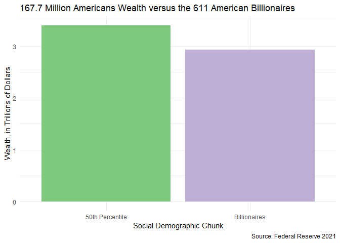
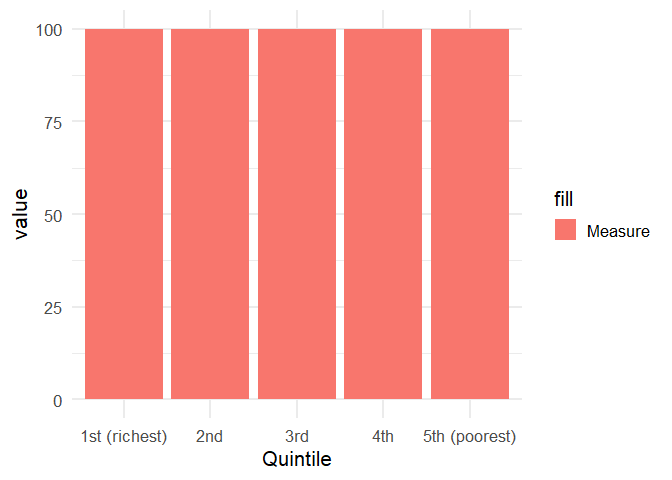

Wealth Quintiles
================
Superb Bilby

``` r
library(tidyverse)
library(readr)
library(scales)

# set default theme for ggplot2
ggplot2::theme_set(ggplot2::theme_minimal(base_size = 16))
```

``` r
bil <- read.csv("../../data/billionaire/Forbes Annual Report Data - 2020.csv", skip = 1) %>% drop_na()
mob <- read.csv("../../data/wealth-mobility/2-wealth-structure.csv")
```

``` r
colnames(bil)[2] <- "wealth"
bil_poor <- bil %>% 
  mutate(wealth = parse_number(wealth) * 1000000,
         bil = "1") %>%
  select(wealth, bil)

# write.csv(bil_poor, "billionaires_simplified.csv", row.names = FALSE)

bil_poor <- read.csv("billionaires_simplified.csv") %>%
  group_by(bil) %>%
  summarise(total_wealth = sum(wealth)) %>%
  ungroup() %>%
  mutate(bil = ifelse(bil == 0, "50th Percentile", "Billionaires"))
  
# Poorest 50% wealth: https://www.bloomberg.com/news/articles/2021-12-17/wealth-share-rose-in-pandemic-for-poorest-50-and-top-1-of-u-s

bil_poor %>%
  ggplot(aes(x = bil, y = total_wealth / 1000000000000, fill = bil)) +
  geom_col() +
  labs(x = "Social Demographic Chunk", 
       y = "Wealth, in Trillions of Dollars",
       title = "167.7 Million Americans Wealth versus the 611 American Billionaires",
       caption = "Source: Federal Reserve 2021") +
  scale_fill_brewer(palette = "Accent") +
  theme_minimal() +
  theme(legend.position = "none")
```

<!-- -->

``` r
# Incomplete

# Quintile sources:
wealth_quintiles <- read.csv("../../data/fed/federal_reserve_quintiles.csv")
colnames(wealth_quintiles)[1] = "Quintile"

wealth_quintiles %>%
  mutate(Quintile = paste0(Quintile, " - ", as.character(Overall), "%")) %>%
  ggplot(aes(x="", y=Overall, fill=Quintile)) +
  geom_bar(stat="identity", width=1, color="white") +
  coord_polar("y", start=0) +
  theme_void() +
  labs(title = "Percentage of Wealth Held by Each Quintile in the United States") +
  scale_fill_brewer(palette = "Set2")
```

<!-- -->

``` r
wealth_quintiles %>%
  pivot_longer(cols = Debt:Financial, names_to = "Measure") %>%
  ggplot(aes(x = Quintile, y = value, fill = "Measure")) +
  geom_bar(posititon = "fill", stat = "identity")
```

    ## Warning: Ignoring unknown parameters: posititon

<!-- -->
